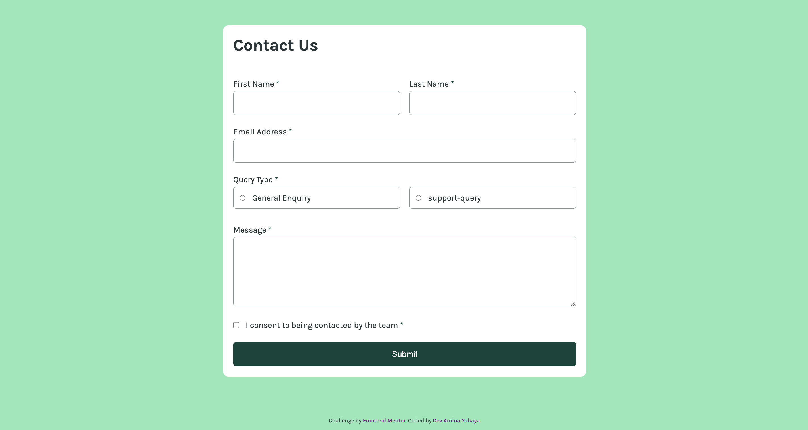

# Frontend Mentor - Contact form solution

This is a solution to the [Contact form challenge on Frontend Mentor](https://www.frontendmentor.io/challenges/contact-form--G-hYlqKJj). Frontend Mentor challenges help you improve your coding skills by building realistic projects.

## Table of contents

- [Overview](#overview)
  - [The challenge](#the-challenge)
  - [Screenshot](#screenshot)
  - [Links](#links)
- [My process](#my-process)
  - [Built with](#built-with)
  - [What I learned](#what-i-learned)
  - [Continued development](#continued-development)
- [Author](#author)

## Overview

### The challenge

Users should be able to:

- Complete the form only using their keyboard - __Done__
- View the optimal layout for the interface depending on their device's screen size - __Done__
- See hover and focus states for all interactive elements on the page - __Done__
__------------ In progress ------------__
- Complete the form and see a success toast message upon successful submission
- Have inputs, error messages, and the success message announced on their screen reader
- Receive form validation messages if:
  - A required field has been missed
  - The email address is not formatted correctly

### Screenshot



### Links

- Live Site URL: [accessible-contact-form](https://accessible-contact-form.web.app/)
- Solution URL: [nil]()

## My process

### Built with

- Semantic HTML5 markup
- CSS custom utility classes
- Mobile-first workflow
- Flexbox

### What I learned

Use this section to recap over some of your major learnings while working through this project. Writing these out and providing code samples of areas you want to highlight is a great way to reinforce your own knowledge.

1. __Accessibility implementation__

```html
<h1>Allow screen readers to announce legend</h1>
<fieldset aria-labelledby="query-type">
    <legend id="query-type" class="labels d-block">
        Query Type
    </legend>
</fieldset>

<h2>Add radio buttons' wrapper to tab order and make it focusable.</h2>
<p tabindex="0">
    <input type="radio"/>
    <label></label>
</p>
```

```css
/* Add focus to button when user is on keyboard only */
button:focus-visible {
	outline-color: #8fe8b9;
}
```
2. __How to reduce css redundancy__
- Implemented Inheritance, group selectors, utility and reusable classes shown below:
    a. Utility Classes Defined:
        - .d-block: Sets the display property to block.
        - .field-txt: Sets the font size to 1.2rem.
        - .width-100: Sets the width to 100%.
        - .txt-centered: Aligns text to the center.
        - .align-vertical: Aligns items vertically in a flex container.
    b. Reusuable Classes Defined:
        - .labels: Styles labels in the form.
        - .button: Styles the button element.
        - .unique-label: Styles unique labels.
        - .radio: Styles the wrapper of radio inputs and their labels


### Continued development
- Practice more responsive designs, media queries and `flex: ; ` shorthand property
- Javascript form validation


## Author

- LinkedIn - [Amina Yahaya](https://www.linkedin.com/mwlite/in/yaminajrfrontend020297)
- Frontend Mentor - [@Amiyahayadev](https://www.frontendmentor.io/profile/Amiyahayadev)
- Twitter - [@ami_dev](https://mobile.twitter.com/ami_dev)
- Medium - [@the-intoverts-ikigai](https://medium.com/@the-Introverts-Ikigai)
